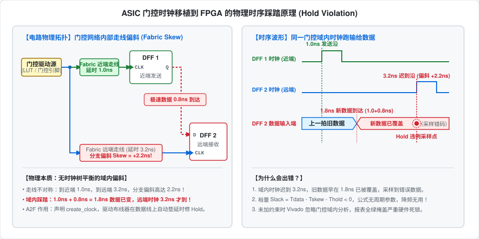

# A2F Clock Retargeter

> **ASIC-to-FPGA 时钟拓扑逆向重映射与时序约束自动化工具**

[](#)
[](#)
[](#)
[](#)

---

## ⚡ 为什么以前移植会出错？(Why It Failed)

在将 **ASIC 原生 RTL** 移植到 **FPGA（如 Xilinx 7-Series / UltraScale+）** 上板验证时，最普遍的板级故障（通信错码、偶发丢包、状态机死锁）都源于**逻辑门控时钟（Gated Clock）在 FPGA 内的物理时序踩踏**：



### 核心物理机制解析

1. **时钟跑输给数据（Fabric 走线偏斜踩踏）**  
   - **ASIC**：门控单元后由专用的 CTS（时钟树综合）进行严格的树状平衡走线，分支到达各寄存器的偏斜（Skew）仅有数十皮秒。
   - **FPGA**：全局时钟缓冲（BUFG）极其稀缺（通常仅 32 个），门控时钟被迫走普通 Fabric（LUT/通用布线），网络分支间产生了 1.5ns ~ 3ns 的不对称走线偏斜（Fabric Skew）。近端寄存器发出的新数据只需 0.8ns 就到达远端，而远端寄存器的时钟沿迟到了 2.2ns！旧数据在被采样前就被新数据冲刷踩踏，造成严重的域内保持时间违例（Hold Violation）。
2. **为什么降频（降晶振）完全无济于事？**  
   - 建立时间（Setup）违例可以通过增大时钟周期（降频）解决；但保持时间裕量公式为：  
     $\text{Slack}_{\text{hold}} = T_{\text{data}} - T_{\text{skew}} - T_{\text{hold}} < 0$  
   - **公式中没有任何时钟周期 $T$ 参数！** 数据走线（0.8ns）比时钟滞后（2.2ns）快是物理硬件事实。无论将板载频率降到 10MHz、1MHz 还是 10kHz，每次触发依然必定发生数据踩踏。
3. **为什么以前在 Vivado 里发现不了？**  
   - **未约束盲区**：过去没有对隐藏深处的数十个门控时钟声明 `create_clock`。Vivado 默认**不对未声明的时钟做静态时序分析（STA）**，Timing Summary 报表显示**全绿通过（Timing Passed）**，给工程师制造“时序收敛”的假象，带着硬件死穴上板。
   - **到处插 BUFG 会炸**：手动在 RTL 里对每个门控插 BUFG，很容易触发 `BUFG 资源超限 (32个上限)` 编译报错，同时污染了纯净的 ASIC RTL。

---

## 🛠️ A2F 是如何解决的？(How A2F Solves It)

A2F 通过 RTL 细化网表静态逆向拓扑，自动生成高质量 `.xdc`：

1. **自动激活域内时序收敛（消除 STA 盲区）**  
   精准抓取所有门控时钟引脚并声明 `create_clock`，将隐藏的门控网络纳入 STA 分析。Vivado 识别到门控网络内部各分支的走线偏斜后，布线器（Router）会在时序驱动下自动在域内数据路径上插入走线延迟，物理弥合时钟偏斜，收敛域内 Hold 违例，无需消耗宝贵的全局 BUFG 资源。
2. **全域跨域时钟隔离（消除布线拥塞）**  
   自动合成 `set_clock_groups -asynchronous`，阻断门控时钟与主时钟之间因时钟树不对称而不可收敛的跨域时序分析，彻底避免布线器盲目尝试收敛跨域物理偏斜导致的算力耗尽、布线死锁与严重拥塞。

> [!NOTE]
> **工程最佳实践**：A2F 自动收敛门控域内的所有时序路径。若 RTL 原生设计中存在极少数从主时钟域单拍无握手向门控域写入数据的强同步路径，建议在 RTL 中配合将该门控改接至触发器的使能引脚（Clock Enable, CE）。

---

## 🚀 快速上手 (Quick Start)

### 1. 外部一键批处理 (推荐，免开 GUI)

- **双击运行（支持拖入工程）**：  
  直接双击 `a2f.bat`，根据提示将 `.xpr` 文件**直接拖入控制台窗口**并按回车。
- **命令行调用**：
  ```cmd
  a2f.bat <工程路径.xpr> [最小时钟扇出:默认4]
  ```

### 2. Vivado GUI 内部交互式运行

在 Vivado Tcl 控制台中执行：

```tcl
# 展开 RTL 细化设计并提取约束
synth_design -rtl -name rtl_1
source D:/Projects/constraint_analyzer/clk_retarget.tcl
retarget_clock_xdc "auto_clock_fix.xdc" 4
```

### 3. 应用生成的约束 (Apply to Project)

在目标 Vivado 工程中将生成的 `auto_clock_fix.xdc` 加入工程：
- **GUI 界面**：点击 `Add Sources` → `Add or create constraints` → 选入 `auto_clock_fix.xdc`；
- **Tcl 脚本**：在综合或实现前调用 `read_xdc auto_clock_fix.xdc`。

---

## 📂 项目结构 (Repository Structure)

```text
.
├── clk_retarget.tcl      # 核心分析引擎 (扇出滤波、原生引脚回溯与约束合成)
├── auto_run_retarget.tcl # 外部批处理入口 (免开 GUI，静默展开 RTL 并调用引擎)
├── a2f.bat               # Windows 一键批处理启动器 (支持零参自检与拖入工程)
├── docs/
│   └── hold_violation.svg# 门控时钟走线偏斜与 Hold 违例物理原理解析图
├── usage.txt             # 快速使用备忘
└── README.md             # 技术文档
```
